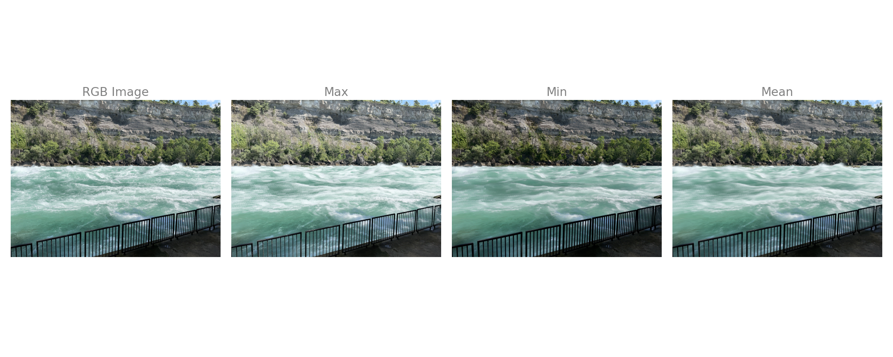

# misty-water-effect

This project was about altering images with water to wake a misty water effect.
First you take a burst of images of a moving water scene. You can take the average of all the images in a burst, take the max of all of them, or take the min.
The effect will be more blurry because it is taking into account more images
No because the trees and mountains are not moving so they are in the same position every image. This means that no matter what method you use, it won’t affect the mountains and trees.
