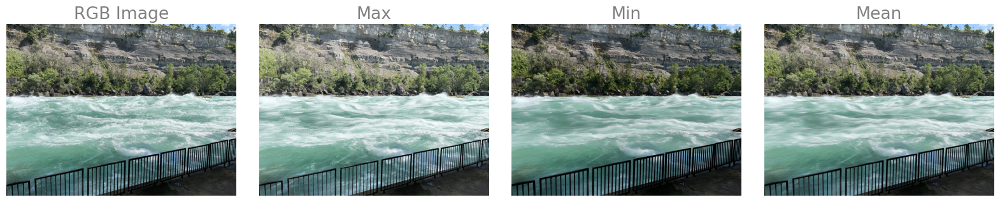

# misty-water-effect

This project was about altering images with water to wake a misty water effect. This algorithm works by taking a burst of images of a moving water scene, then taking the average, max, or min of all the images. Note that the trees and mountains are not moving so they are in the same position every image. This means that no matter what method you use, it won’t affect the mountains and trees.
